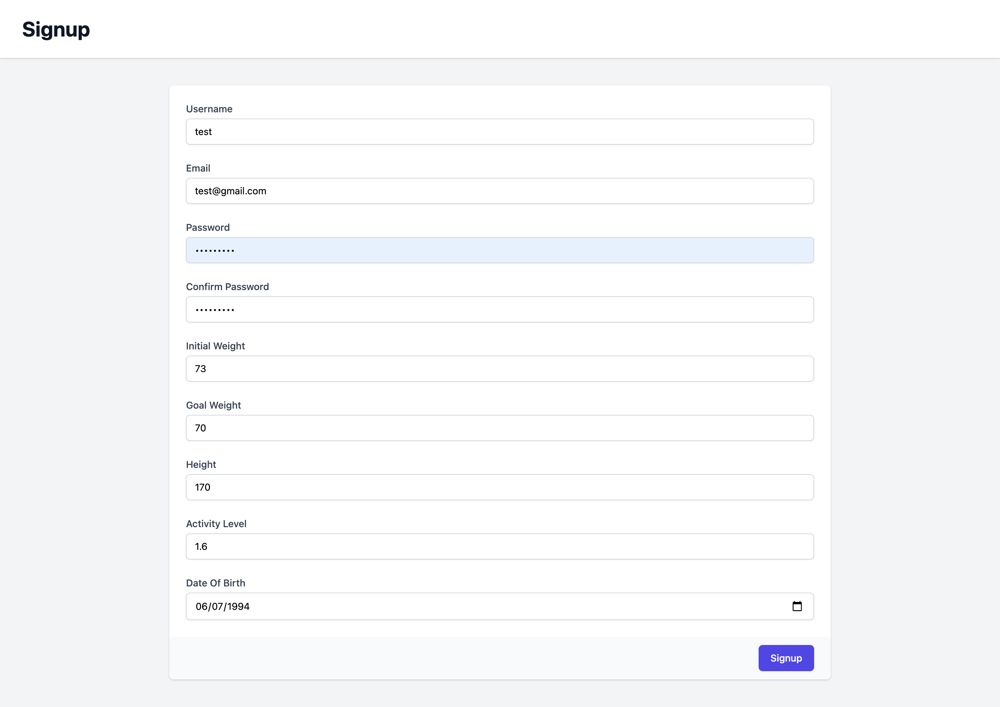
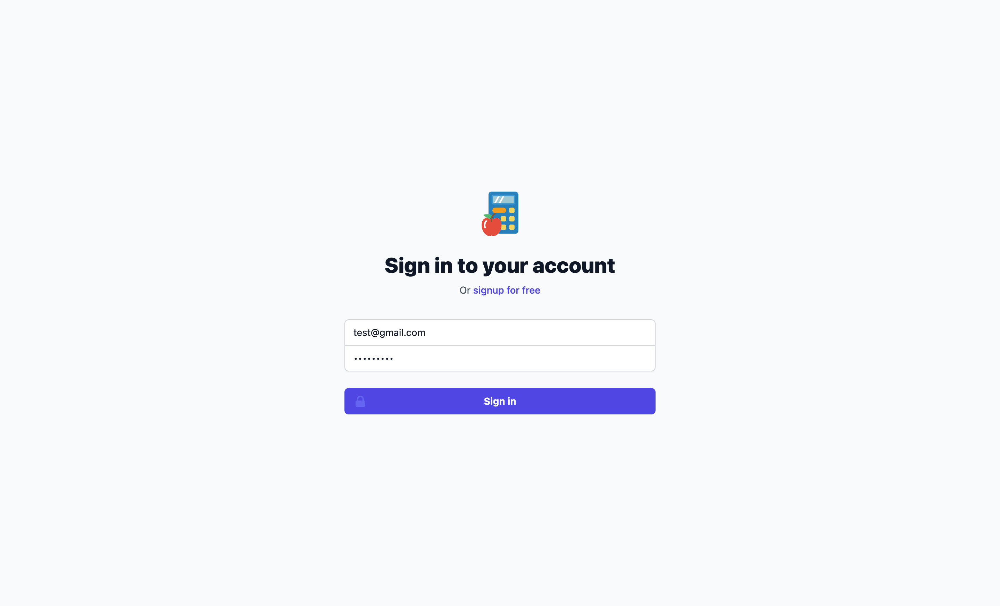
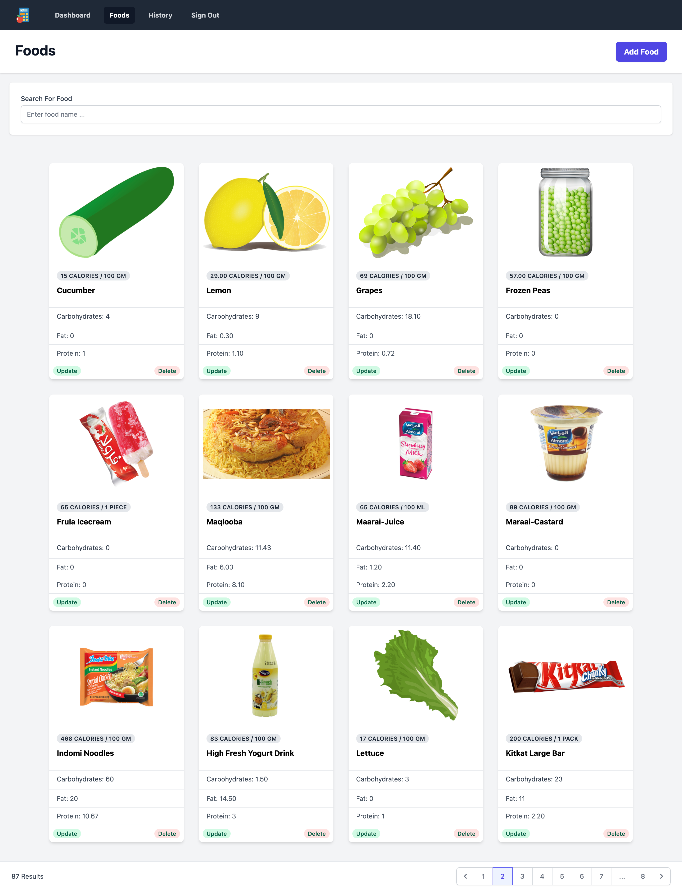
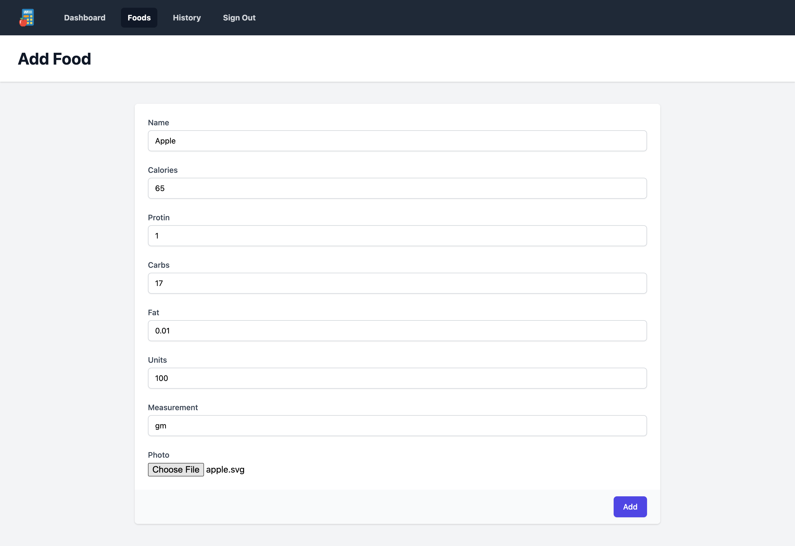
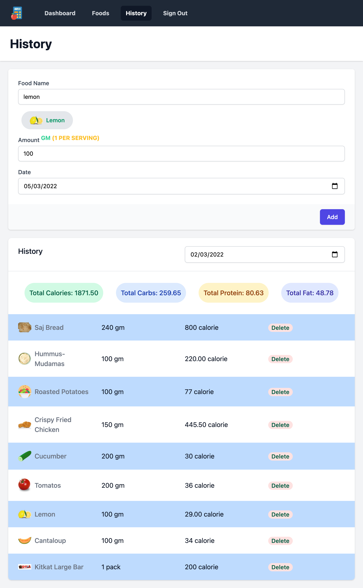
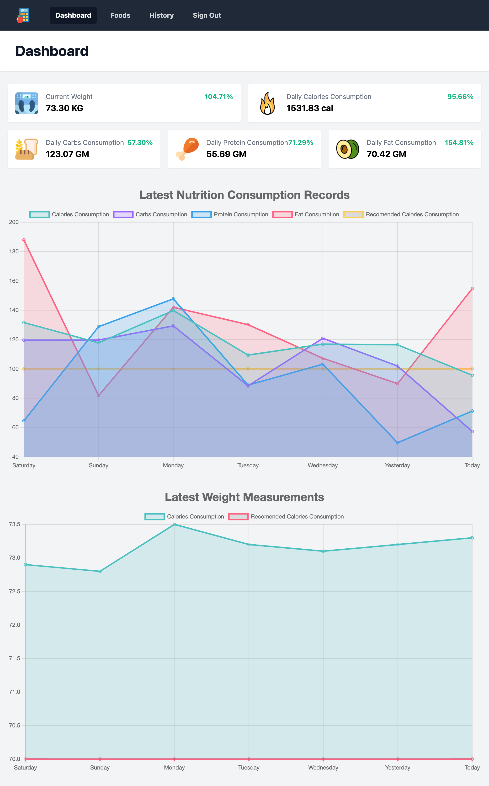

<a href="https://reverent-swartz-334ee9.netlify.app/" target="_blank" style="display:flex; align-items:center; gap:8px;">

Live Demo
</a> 

  
    Nutrition tracker is a full-stack responsive web app application. The app
    collects its user's food consumption and presents them with convenient
    charts and statistics regarding their daily recommended nutrients and
    calories consumption.
  

  
    The client-side of this app was written with ReactJs, Typescript, SCSS, and
    many other libraries that provide the user with a rich and responsive visual
    experience.It exchanges its data with the server through multiple Rest API
    endpoints. The server has been developed using NodeJs, Express, and MongoDB.
  

  

    

      <h3 class="ui black huge header">
        Signup/Login
      </h3>
      

        
          Before using the app, the user must log in with his credentials or he
          can go and signup. When the users sign up, they should fill in some
          information regarding their weight, height, age, activity level, and
          the weight they aspire to reach. These pieces of information will be
          used to calculate the recommended amount of nutrients a user should
          consume on daily basis to reach their goal weight.
        
      

    

    

      
      
    

  

  

    

      <h3 class="ui black huge header">
        Foods
      </h3>
      

        
          After the user has signed in. he can go to the foods page where he can
          view the foods he added earlier and update/add new food. Each added
          food has its nutritional content of calories, proteins, carbohydrates,
          and fats.
        
      

    

    

      
      
    

  

  

    

      <h3 class="ui black huge header">
        History
      </h3>
      

        
          On the history page, the user can fill in the foods he ate throughout
          the day and their quantities, and he can view the foods he ate on a
          certain date.
        
      

    

    

      
    

  

  

    

      <h3 class="ui black huge header">
        Dashboard
      </h3>
      

        
          On the dashboard page, the user is presented with statistics on his
          daily consumption of calories and nutrients. In addition, the user can
          view various charts that show the change in his weight and consumption
          of nutrients over the past few days
        
      

    

    

      
    

  

