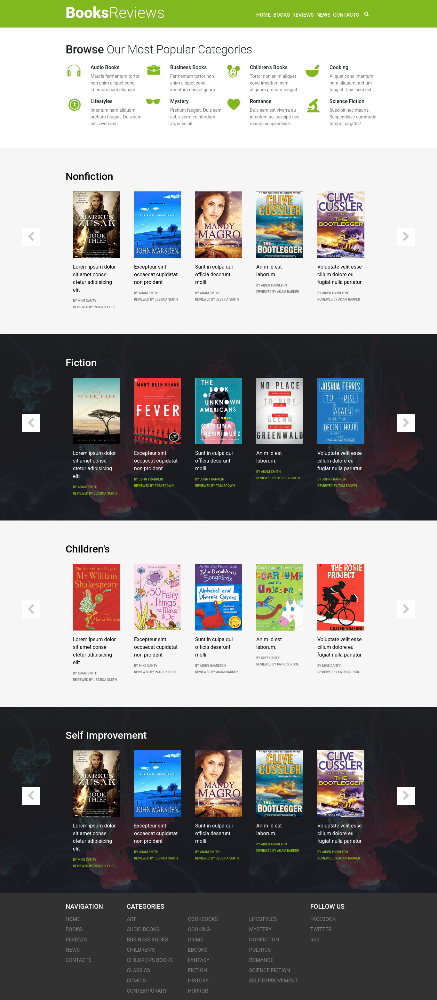
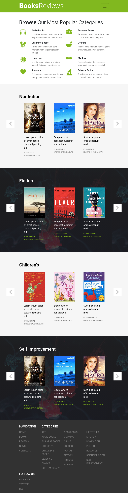
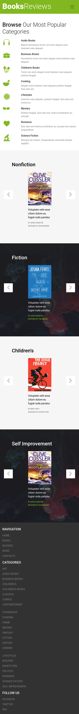

<a href="https://mohammadhh.github.io/book-shelf" target="_blank" style="display:flex; align-items:center; gap:8px;">

Live Demo
</a> 
<a href="https://github.com/MohammadHH/book-shelf" target="_blank" style="display:flex; align-items:center; gap:8px;margin-top:8px;">

Source Code
</a> 

In this project, a land page design mock for a book-shelf has been implemented using ReactJs and Bootstrap. The page has a navbar, header,multiple set of carousels containing books covers, and a footer. All of distinct pieces that make up the page has been separated to their own components, where each one has its styles, visuals and responsivity implemented.

 

  
  
  

